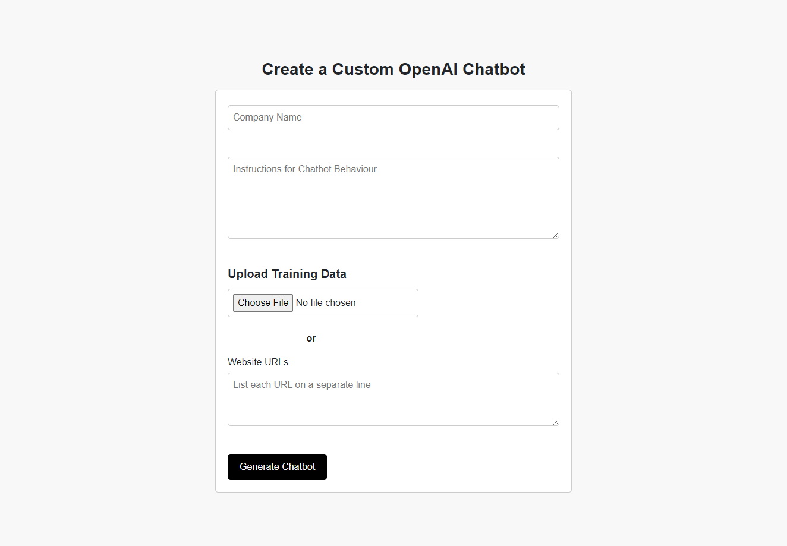

A web-based application that allows users to create an OpenAI assistant with custom instructions and data (either a .txt file, or website URLs). The deployment can take some time to load up (using the free-tier), so I've included screenshots below. 

<h3>Interface Screenshots</h3>

<h3>Deployment:</h3> https://ai-chatbot-inol.onrender.com

